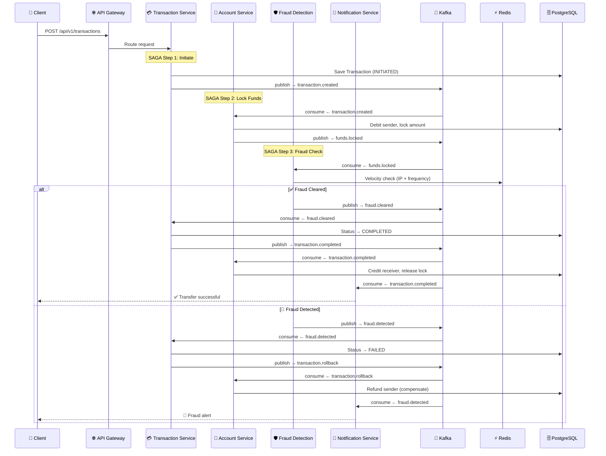

<div align="center">

# 🏦 Digital Banking Fraud Detection System

**Real-time fraud detection with sub-2-second money transfers using SAGA distributed transactions**

[](https://openjdk.org/)
[](https://spring.io/projects/spring-boot)
[](https://kafka.apache.org/)
[](https://redis.io/)
[](https://www.postgresql.org/)
[](https://docs.docker.com/compose/)
[](LICENSE)

</div>

---

## 📋 Overview

A production-grade **distributed microservices** system that processes digital banking transfers in **under 2 seconds**, with **real-time fraud detection** powered by Redis (sub-millisecond velocity checks) and **data consistency guarantees** via the **SAGA choreography pattern** over Apache Kafka.

### Key Capabilities

| Capability | Description |
|---|---|
| ⚡ **< 2s Transfers** | End-to-end money transfer completing within the 2-second SLA |
| 🛡️ **Real-time Fraud Detection** | Sub-millisecond checks using Redis sorted sets for IP velocity, transaction frequency, and amount thresholds |
| 🔄 **SAGA Pattern** | Choreography-based distributed transactions with automatic compensating rollbacks |
| 📨 **Event-Driven** | Fully asynchronous communication via Apache Kafka event streaming |
| 🔔 **Instant Notifications** | Async user alerts on transaction completion, failure, or fraud detection |

---

## 🏗️ Architecture

### System Overview

```
┌──────────────┐
│    Client     │
└──────┬───────┘
       │
┌──────▼───────┐
│  API Gateway  │ :8080
│ (Spring Cloud)│
└──────┬───────┘
       │ Routes
       ├─────────────────────┐
       │                     │
┌──────▼───────┐     ┌──────▼───────┐
│ Transaction  │     │   Account    │
│   Service    │     │   Service    │
│   :8081      │     │   :8082      │
└──────┬───────┘     └──────┬───────┘
       │                     │
       │    ┌────────────┐   │
       └────► Apache     ◄───┘
            │  Kafka     │
       ┌────►            ◄───┐
       │    └────────────┘   │
       │                     │
┌──────┴───────┐     ┌──────┴───────┐
│    Fraud     │     │ Notification │
│  Detection   │     │   Service    │
│   :8083      │     │   :8084      │
└──────┬───────┘     └──────────────┘
       │
┌──────▼───────┐
│    Redis     │
│  (Velocity   │
│   Checks)    │
└──────────────┘
```

### SAGA Flow — Sequence Diagram



### Kafka Topics

| Topic | Producer | Consumer(s) | Purpose |
|---|---|---|---|
| `transaction.created` | transaction-service | account-service | Trigger fund locking |
| `funds.locked` | account-service | fraud-detection-service | Trigger fraud check |
| `funds.lock-failed` | account-service | transaction-service | Insufficient funds → fail |
| `fraud.cleared` | fraud-detection-service | transaction-service | Proceed to completion |
| `fraud.detected` | fraud-detection-service | transaction-service, notification-service | Trigger rollback + alert |
| `transaction.completed` | transaction-service | account-service, notification-service | Credit receiver + notify |
| `transaction.rollback` | transaction-service | account-service, notification-service | Compensate sender + notify |

---

## 🛠️ Tech Stack

| Layer | Technology | Version | Purpose |
|---|---|---|---|
| **Language** | Java | 17+ | Core language |
| **Framework** | Spring Boot | 4.1.1 | Microservices framework |
| **Cloud** | Spring Cloud | 2025.1.3 | API Gateway, OpenFeign |
| **Messaging** | Apache Kafka | 7.4 (Confluent) | Event streaming & SAGA choreography |
| **Cache** | Redis | 7 | Sub-ms fraud velocity checks |
| **Database** | PostgreSQL | 16 | Account & transaction persistence |
| **Build** | Maven | 3.9+ | Multi-module build |
| **Containers** | Docker Compose | 3.8 | Local infrastructure |

---

## 📁 Project Structure

```
DigitalBanking/
├── api-gateway/                    # 🌐 Entry point — routes to services
│   └── src/main/
│       ├── java/.../ApiGatewayApplication.java
│       └── resources/application.yaml
│
├── transaction-service/            # 💳 SAGA orchestrator — manages transfer state
│   └── src/main/java/.../
│       ├── controller/TransactionController.java
│       ├── entity/Transaction.java
│       ├── service/TransactionService.java
│       ├── service/TransactionSagaOrchestrator.java
│       └── config/KafkaConfig.java
│
├── account-service/                # 🏦 Fund locking & compensation
│   └── src/main/java/.../
│       ├── controller/AccountController.java
│       ├── entity/Account.java
│       ├── service/AccountService.java
│       ├── service/AccountEventConsumer.java
│       └── config/KafkaConfig.java
│
├── fraud-detection-service/        # 🛡️ Redis-based real-time fraud checks
│   └── src/main/java/.../
│       ├── service/FraudDetectionService.java
│       ├── service/FraudEventConsumer.java
│       ├── config/RedisConfig.java
│       └── config/KafkaConfig.java
│
├── notification-service/           # 🔔 Async user alerts
│   └── src/main/java/.../
│       ├── service/NotificationService.java
│       └── service/NotificationEventConsumer.java
│
├── docker-compose.yml              # 🐳 Kafka, Zookeeper, Redis, PostgreSQL
├── pom.xml                         # 📦 Parent POM (multi-module)
└── README.md
```

---

## ⚙️ Prerequisites

- **Java 17+** — `java -version`
- **Maven 3.9+** — `mvn -version`
- **Docker & Docker Compose** — `docker compose version`

---

## 🚀 Getting Started

### 1. Clone the Repository

```bash
git clone https://github.com/Phuc101202/DigitalBanking.git
cd DigitalBanking
```

### 2. Start Infrastructure

```bash
docker compose up -d
```

This spins up:
| Service | Port |
|---|---|
| PostgreSQL | `5432` |
| Redis | `6379` |
| Kafka Broker | `9092` |
| Zookeeper | `2181` |

### 3. Run Microservices

Open separate terminals for each service:

```bash
# Terminal 1 — API Gateway
cd api-gateway && mvn spring-boot:run

# Terminal 2 — Transaction Service
cd transaction-service && mvn spring-boot:run

# Terminal 3 — Account Service
cd account-service && mvn spring-boot:run

# Terminal 4 — Fraud Detection Service
cd fraud-detection-service && mvn spring-boot:run

# Terminal 5 — Notification Service
cd notification-service && mvn spring-boot:run
```

### 4. Verify

```bash
# Health check
curl http://localhost:8080/actuator/health
```

---

## 📡 API Endpoints

All requests go through the **API Gateway** at `http://localhost:8080`.

### Transaction Service

| Method | Endpoint | Description |
|---|---|---|
| `POST` | `/api/v1/transactions` | Initiate a money transfer |
| `GET` | `/api/v1/transactions/{transactionId}` | Get transaction status |

#### Example — Initiate Transfer

```bash
curl -X POST http://localhost:8080/api/v1/transactions \
  -H "Content-Type: application/json" \
  -d '{
    "senderAccountNumber": "100000000001",
    "receiverAccountNumber": "100000000002",
    "amount": 500.00,
    "description": "Rent payment",
    "sourceIp": "192.168.1.100"
  }'
```

**Response:**

```json
{
  "transactionId": "a1b2c3d4-e5f6-7890-abcd-ef1234567890",
  "senderAccountNumber": "100000000001",
  "receiverAccountNumber": "100000000002",
  "amount": 500.00,
  "status": "INITIATED",
  "createdAt": "2026-09-22T10:30:00"
}
```

### Account Service

| Method | Endpoint | Description |
|---|---|---|
| `POST` | `/api/v1/accounts` | Create a new account |
| `GET` | `/api/v1/accounts/{accountNumber}` | Get account details |
| `GET` | `/api/v1/accounts/{accountNumber}/balance` | Get account balance |
| `PUT` | `/api/v1/accounts/{accountNumber}/block` | Block an account |

---

## 🛡️ Fraud Detection Rules

The fraud detection service performs **sub-millisecond** checks using Redis:

| Rule | Description | Redis Structure |
|---|---|---|
| **Transaction Frequency** | Max 5 transactions per 10-minute window per account | Sorted Set with timestamp scores |
| **IP Velocity** | Flags transactions from different IPs within 5 minutes | String key with TTL |
| **Amount Threshold** | Flags single transactions exceeding 10,000 | In-memory check |

---

## 🔄 SAGA Compensation Matrix

| Step | Action | Compensation (on failure) |
|---|---|---|
| 1. Transaction Created | Save to DB as `INITIATED` | Mark as `FAILED` |
| 2. Funds Locked | Debit sender, hold in `lockedAmount` | Refund `lockedAmount` back to `balance` |
| 3. Fraud Check | Run Redis velocity rules | Release locked funds |
| 4. Transaction Completed | Credit receiver | — (terminal state) |

---

## 📄 License

This project is licensed under the MIT License — see the [LICENSE](LICENSE) file for details.

---

<div align="center">

**Built with ❤️ for learning distributed systems, SAGA patterns, and real-time fraud detection.**

</div>
