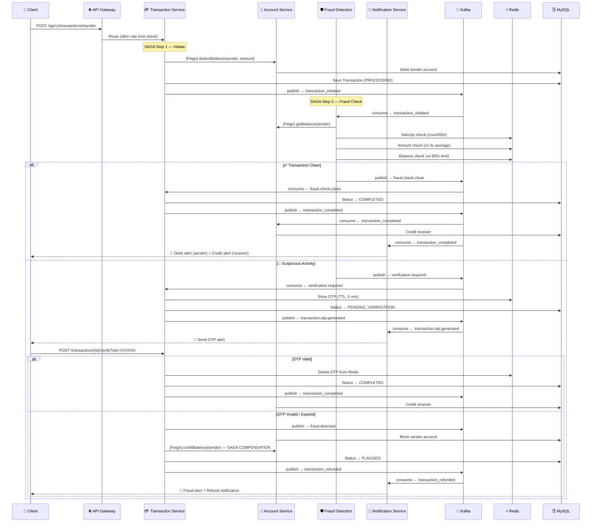

<div align="center">

# 🏦 Digital Banking Fraud Detection System

**Real-time fraud detection with OTP verification and Razorpay payment integration**

[](https://openjdk.org/)
[](https://spring.io/projects/spring-boot)
[](https://kafka.apache.org/)
[](https://redis.io/)
[](https://www.mysql.com/)
[](https://docs.docker.com/compose/)
[](https://razorpay.com/)
[](LICENSE)

</div>

---

## 📋 Overview

A production-grade **distributed microservices** system for digital banking that handles real-time money transfers with fraud detection, OTP verification, and Razorpay payment gateway integration. The system uses the **SAGA choreography pattern** over Apache Kafka to guarantee data consistency across all services — ensuring a transfer never gets stuck halfway if something fails.

### Key Capabilities

| Capability | Description |
|---|---|
| 🔄 **SAGA Pattern** | Choreography-based distributed transactions with automatic compensating rollbacks via Kafka events |
| 🛡️ **3-Layer Fraud Detection** | Velocity check, suspicious amount check (3x average), and balance percentage check (90%) using Redis |
| 🔐 **OTP Verification** | Suspicious transactions trigger 6-digit OTP stored in Redis with 5-minute TTL, sent via notification |
| 💳 **Razorpay Integration** | Create payment orders, handle webhook callbacks for capture/failure events |
| ⚡ **Rate Limiting** | Redis-backed request rate limiting at API Gateway (10 req/s, burst 20) |
| 🔔 **Async Notifications** | Full event-driven alert system for debit, credit, OTP, fraud, refund, and payment events |

---

## 🏗️ Architecture

### System Overview

```
┌──────────────────────────────────┐
│           Client / Frontend       │
└──────────────┬───────────────────┘
               │
┌──────────────▼───────────────────┐
│           API Gateway             │  :8080
│   (Rate Limiting via Redis/       │
│    Spring Cloud Gateway WebFlux)  │
└──────┬───────────────────┬────────┘
       │                   │
┌──────▼──────┐    ┌───────▼──────┐
│ Transaction  │    │   Account    │
│   Service    │    │   Service    │
│    :8082     │    │    :8081     │
└──────┬───────┘    └──────┬───────┘
       │                   │
       │     ┌─────────────┤
       │     │   Apache    │
       └────►│    Kafka    ◄───────────────┐
             │             │               │
       ┌─────►             ◄───┐    ┌──────┴───────┐
       │     └──────┬──────┘   │    │  Notification │
       │            │           │    │    Service    │
┌──────┴──────┐     │      ┌────┴──┐ │    :8085      │
│   Fraud     │     │      │Redis  │ └──────────────┘
│  Detection  │◄────┘      │ OTP + │
│   Service   │            │ Rate  │
│    :8083    │            │ Limit │
└─────────────┘            └───────┘
                                         ┌─────────────┐
                                         │   Payment   │
                                         │   Service   │
                                         │  (Razorpay) │
                                         └─────────────┘
```

### SAGA Flow — Complete Sequence Diagram


```mermaid
sequenceDiagram
    participant C as 👤 Client
    participant GW as 🌐 API Gateway
    participant TS as 💳 Transaction Service
    participant AS as 🏦 Account Service
    participant FD as 🛡️ Fraud Detection
    participant NS as 🔔 Notification Service
    participant K as 📨 Kafka
    participant R as ⚡ Redis
    participant DB as 🗄️ MySQL

    C->>GW: POST /api/v1/transactions/transfer
    GW->>TS: Route (after rate limit check)

    Note over TS: SAGA Step 1 — Initiate
    TS->>AS: [Feign] deductBalance(sender, amount)
    AS->>DB: Debit sender account
    TS->>DB: Save Transaction (PROCESSING)
    TS->>K: publish → transaction_initiated

    Note over FD: SAGA Step 2 — Fraud Check
    K->>FD: consume ← transaction_initiated
    FD->>AS: [Feign] getBalance(sender)
    FD->>R: Velocity check (count/60s)
    FD->>R: Amount check (vs 3x average)
    FD->>R: Balance check (vs 90% limit)

    alt ✅ Transaction Clean
        FD->>K: publish → fraud.check.clean
        K->>TS: consume ← fraud.check.clean
        TS->>DB: Status → COMPLETED
        TS->>K: publish → transaction_completed
        K->>AS: consume ← transaction_completed
        AS->>DB: Credit receiver
        K->>NS: consume ← transaction_completed
        NS-->>C: 💬 Debit alert (sender) + Credit alert (receiver)

    else 🚨 Suspicious Activity
        FD->>K: publish → verification.required
        K->>TS: consume ← verification.required
        TS->>R: Store OTP (TTL: 5 min)
        TS->>DB: Status → PENDING_VERIFICATION
        TS->>K: publish → transaction.otp.generated
        K->>NS: consume ← transaction.otp.generated
        NS-->>C: 🔐 Send OTP alert

        C->>TS: POST /transactions/{id}/verify?otp=XXXXXX

        alt OTP Valid
            TS->>R: Delete OTP from Redis
            TS->>DB: Status → COMPLETED
            TS->>K: publish → transaction_completed
            AS->>DB: Credit receiver
        else OTP Invalid / Expired
            TS->>K: publish → fraud.detected
            AS->>DB: Block sender account
            TS->>AS: [Feign] creditBalance(sender) — SAGA COMPENSATION
            TS->>DB: Status → FLAGGED
            TS->>K: publish → transaction_refunded
            K->>NS: consume ← transaction_refunded
            NS-->>C: 🚨 Fraud alert + Refund notification
        end
    end
```

### Kafka Topics

| Topic | Producer | Consumer(s) | Purpose |
|---|---|---|---|
| `transaction_initiated` | transaction-service | fraud-detection-service | Trigger fraud check |
| `fraud.check.clean` | fraud-detection-service | transaction-service | Mark transaction complete |
| `verification.required` | fraud-detection-service | transaction-service | Trigger OTP generation |
| `transaction.otp.generated` | transaction-service | notification-service | Send OTP to user |
| `fraud.detected` | transaction-service | account-service, notification-service | Block account + notify |
| `transaction_completed` | transaction-service | account-service, notification-service | Credit receiver + notify |
| `transaction_refunded` | transaction-service | notification-service | Notify refund |
| `payment.completed` | payment-service | notification-service | Payment success alert |
| `payment.failed` | payment-service | notification-service | Payment failure alert |

---

## 🛠️ Tech Stack

| Layer | Technology | Version | Purpose |
|---|---|---|---|
| **Language** | Java | 17+ | Core language |
| **Framework** | Spring Boot | 4.1.1 | Microservices framework |
| **Cloud** | Spring Cloud | 2025.1.3 | API Gateway, OpenFeign |
| **Messaging** | Apache Kafka | 7.4 (Confluent) | SAGA choreography & event streaming |
| **Cache** | Redis | 7 | OTP storage, fraud velocity checks, rate limiting |
| **Database** | MySQL | 8.0 | Account & transaction persistence |
| **Payment** | Razorpay Java SDK | 1.4.6 | Payment order creation & webhook handling |
| **Build** | Maven | 3.9+ | Per-service build |
| **Containers** | Docker Compose | 3.8 | Local infrastructure |

---

## 📁 Project Structure

```
DigitalBanking/
│
├── api-gateway/                          # 🌐 Entry point — rate limiting, routing
│   └── src/main/java/.../
│       ├── config/RateLimitConfig.java   # KeyResolver (IP-based) for Redis rate limiting
│       └── resources/application.yaml   # Routes: /account/**, /transactions/**
│
├── transaction-service/                  # 💳 SAGA orchestrator — transfer & OTP flow
│   └── src/main/java/.../
│       ├── controller/TransactionController.java     # POST /transfer, GET /{id}, POST /{id}/verify
│       ├── service/TransactionService.java           # SAGA steps, OTP verify, compensation
│       ├── service/TransactionEventConsumer.java     # Kafka: verification.required, fraud.check.clean
│       ├── entity/Transaction.java
│       └── entity/TransactionStatus.java             # PENDING → PROCESSING → COMPLETED / FLAGGED
│
├── account-service/                      # 🏦 Account management & fund operations
│   └── src/main/java/.../
│       ├── controller/AccountController.java         # CRUD + /deduct + /credit + /block
│       ├── service/AccountService.java               # deductBalance, creditBalance, blockAccount
│       └── service/AccountEventConsumer.java         # Kafka: transaction.completed → credit receiver
│
├── fraud-detection-service/              # 🛡️ 3-layer Redis fraud checks
│   └── src/main/java/.../
│       ├── service/FraudDetectionService.java        # Velocity, amount, balance checks
│       ├── service/FraudDetectionEventConsumer.java  # Kafka: transaction_initiated
│       └── client/AccountServiceClient.java          # Feign: getBalance()
│
├── notification-service/                 # 🔔 Async alerts for all events
│   └── src/main/java/.../
│       └── service/NotificationService.java          # 6 Kafka consumers (OTP, debit, credit, fraud, refund, payment)
│
├── payment-service/                      # 💳 Razorpay payment gateway
│   └── src/main/java/.../
│       ├── controller/PaymentController.java         # POST /create-order, POST /webhook
│       └── service/PaymentService.java               # Razorpay order creation, webhook handling
│
├── docker-compose.yml                    # Kafka, Zookeeper, Redis, MySQL
└── README.md
```

---

## ⚙️ Prerequisites

- **Java 17+** — `java -version`
- **Maven 3.9+** — `mvn -version`
- **Docker & Docker Compose** — `docker compose version`
- **Razorpay Account** — for payment-service (optional, other services work independently)

---

## 🚀 Getting Started

### 1. Clone the Repository

```bash
git clone https://github.com/Phuc101202/DigitalBanking.git
cd DigitalBanking
```

### 2. Start Infrastructure

```bash
docker compose up -d
```

This spins up:

| Service | Port |
|---|---|
| MySQL | `3306` |
| Redis | `6379` |
| Kafka Broker | `9092` |
| Zookeeper | `2181` |

### 3. Configure `payment-service` (Optional)

Add your Razorpay credentials to `payment-service/src/main/resources/application.yaml`:

```yaml
razorpay:
  key:
    id: YOUR_RAZORPAY_KEY_ID
    secret: YOUR_RAZORPAY_KEY_SECRET
```

### 4. Run Microservices

Open separate terminals for each service:

```bash
# Terminal 1 — API Gateway (port 8080)
cd api-gateway && .\mvnw spring-boot:run

# Terminal 2 — Account Service (port 8081)
cd account-service && .\mvnw spring-boot:run

# Terminal 3 — Transaction Service (port 8082)
cd transaction-service && .\mvnw spring-boot:run

# Terminal 4 — Fraud Detection Service (port 8083)
cd fraud-detection-service && .\mvnw spring-boot:run

# Terminal 5 — Notification Service (port 8085)
cd notification-service && .\mvnw spring-boot:run

# Terminal 6 — Payment Service (optional)
cd payment-service && .\mvnw spring-boot:run
```

### 5. Verify

```bash
curl http://localhost:8080/actuator/health
```

---

## 📡 API Endpoints

All requests go through the **API Gateway** at `http://localhost:8080`.

### Account Service

| Method | Endpoint | Description |
|---|---|---|
| `POST` | `/api/v1/accounts` | Create a new account |
| `GET` | `/api/v1/accounts/{accountNumber}` | Get account details |
| `GET` | `/api/v1/accounts/{accountNumber}/balance` | Get account balance |
| `PUT` | `/api/v1/accounts/{accountNumber}/block` | Block an account (fraud action) |
| `PUT` | `/api/v1/accounts/{accountNumber}/deduct` | Deduct balance (called by Transaction Service via Feign) |
| `PUT` | `/api/v1/accounts/{accountNumber}/credit` | Credit balance (called by Transaction Service via Feign) |

### Transaction Service

| Method | Endpoint | Description |
|---|---|---|
| `POST` | `/api/v1/transactions/transfer` | Initiate a money transfer (starts SAGA) |
| `GET` | `/api/v1/transactions/{transactionId}` | Get transaction status |
| `GET` | `/api/v1/transactions/account/{accountNumber}` | Get transaction history |
| `POST` | `/api/v1/transactions/{transactionId}/verify?otp=XXXXXX` | Submit OTP to complete a flagged transaction |

### Payment Service

| Method | Endpoint | Description |
|---|---|---|
| `POST` | `/api/v1/payments/create-order` | Create a Razorpay payment order |
| `POST` | `/api/v1/payments/webhook` | Razorpay webhook callback (payment captured/failed) |

---

### Example — Initiate Transfer

```bash
curl -X POST http://localhost:8080/api/v1/transactions/transfer \
  -H "Content-Type: application/json" \
  -d '{
    "senderAccountNumber": "100000000001",
    "receiverAccountNumber": "100000000002",
    "amount": 500.00,
    "description": "Rent payment"
  }'
```

**Response:**

```json
{
  "id": "a1b2c3d4-...",
  "senderAccountNumber": "100000000001",
  "receiverAccountNumber": "100000000002",
  "amount": 500.00,
  "status": "PROCESSING",
  "createdAt": "2026-09-30T10:00:00"
}
```

---

## 🛡️ Fraud Detection Rules

Checked via `FraudDetectionService` using Redis — triggered on every `transaction_initiated` event:

| # | Rule | Threshold | Redis Structure |
|---|---|---|---|
| 1 | **Velocity Check** | > `maxTransactionsPerMinute` (configurable) in 60s | `INCR` counter with 60s TTL |
| 2 | **Unusual Amount** | > 3x running average of past transactions | Rolling average stored as String |
| 3 | **Balance Drain** | > 90% of account balance in single transaction | Compared against live Feign balance |

> If **any rule triggers** → `verification.required` event → OTP generated & stored in Redis (TTL 5 min) → user must verify via `/verify` endpoint.

---

## 🔄 SAGA State Machine

```
PENDING
  └─► PROCESSING          (funds deducted from sender)
        ├─► COMPLETED      (fraud clean → receiver credited)
        ├─► PENDING_VERIFICATION  (suspicious → OTP sent)
        │     ├─► COMPLETED      (OTP valid → receiver credited)
        │     └─► FLAGGED        (OTP invalid/expired → refund + account blocked)
        └─► FLAGGED        (other failure → SAGA compensation, refund)
```

### SAGA Compensation Matrix

| Step | Action | Compensating Action |
|---|---|---|
| 1. Deduct Sender | `accountServiceClient.deductBalance()` via Feign | `accountServiceClient.creditBalance()` — refund |
| 2. Fraud Check | Publish `transaction_initiated` to Kafka | Publish `verification.required` |
| 3. OTP Verify | Store OTP in Redis (5 min TTL) | Delete OTP, publish `fraud.detected`, block account |
| 4. Credit Receiver | `accountServiceClient.creditBalance()` via Kafka consumer | — (terminal state) |

---

## 🔔 Notification Events

The `notification-service` listens to all terminal Kafka events and logs structured alerts:

| Kafka Topic | Alert Type | Recipient |
|---|---|---|
| `transaction.otp.generated` | OTP Verification Required | Sender |
| `transaction_completed` | Debit Alert | Sender |
| `transaction_completed` | Credit Alert | Receiver |
| `fraud.detected` | Suspicious Activity / Account Blocked | Sender |
| `transaction_refunded` | Refund Processed | Sender |
| `payment.completed` | Payment Successful (Razorpay) | Account holder |
| `payment.failed` | Payment Failed (Razorpay) | Account holder |

---

## 📄 License

This project is licensed under the MIT License — see the [LICENSE](LICENSE) file for details.

---

<div align="center">

**Built with ❤️ for learning distributed systems, SAGA patterns, and real-time fraud detection.**

</div>
